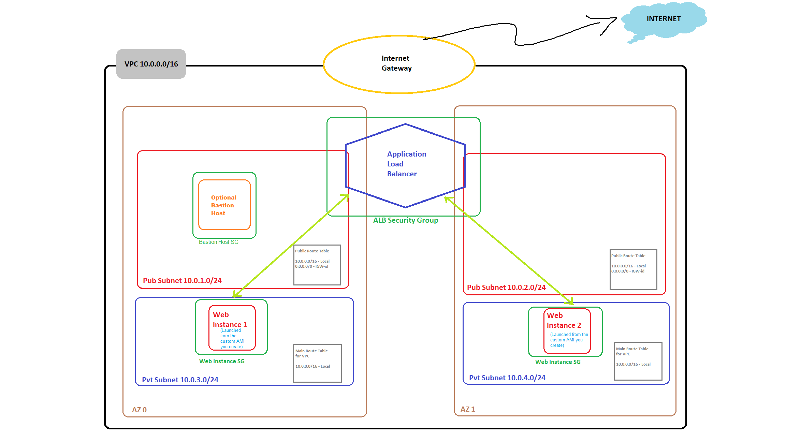

# Project 2: AWS Administration

## Overview

This project was completed for the AWS Administration class in Fall 2024. It is a continuation of . This project focuses on deploying the previously created application using "nested templates" and developing the skillset around using them. 

## Project Structure

- **Network Stack**: Deploys the necessary network infrastructure.
- **Compute Stack**: Manages the deployment of compute resources for the web application.

## Architecture Diagram

To understand the overall architecture of the deployment, please refer to the following diagram:

